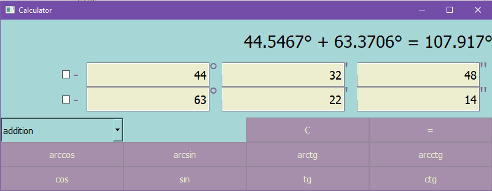
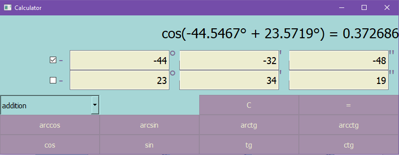
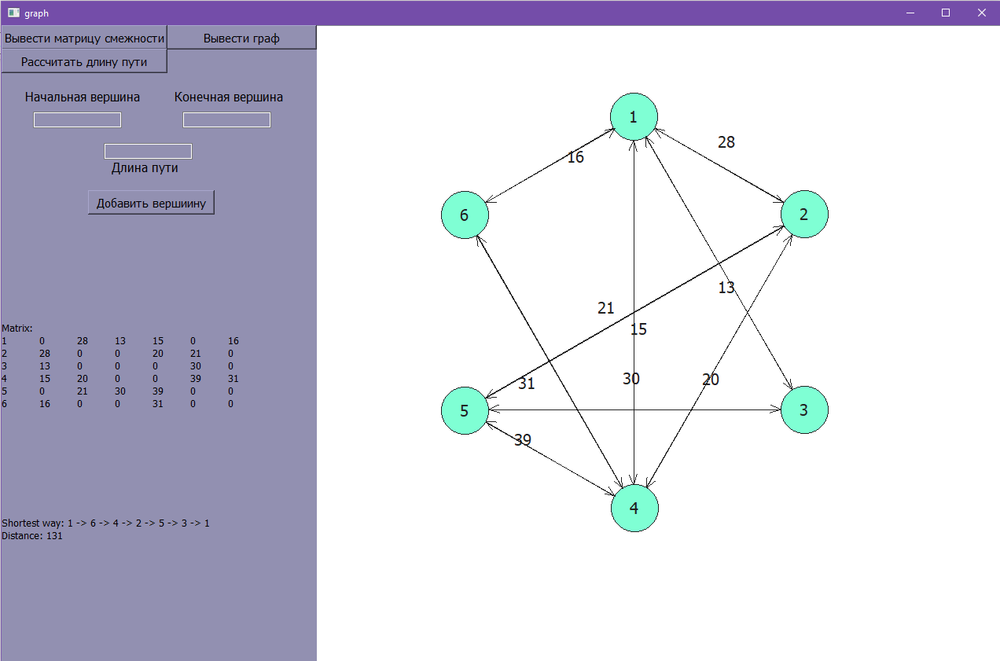
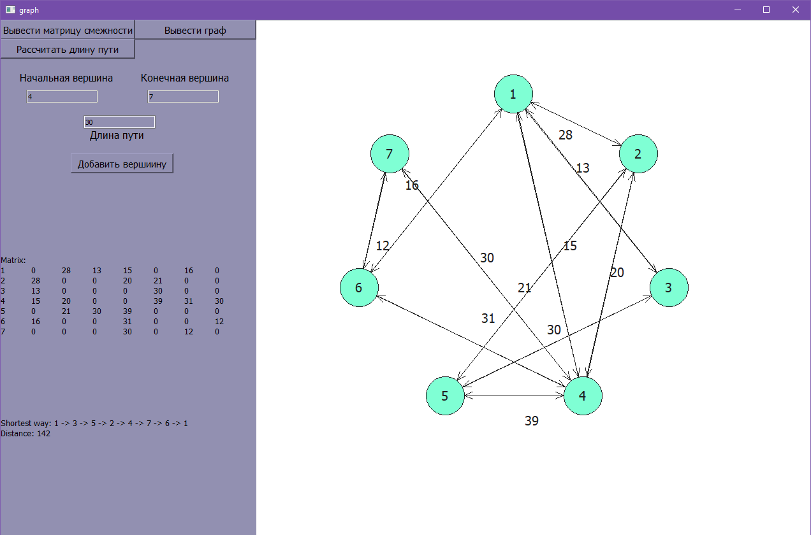

Two Qt Widgets desktop apps in C++.

## 1 — DMS angle calculator

Enter angles in degrees/minutes/seconds, pick a binary operation (+, −, ×, ÷) or a trig / inverse-trig function (sin, cos, tan, cot and their inverses), and get the result. Sign of each angle is toggled independently.

## 2 — Traveling Salesman Problem solver

Solves TSP with the branch-and-bound method: repeated matrix reduction (subtracting row/column minimums) plus a penalty score to pick which zero-cost edge to branch on next. Starts from a preset example graph and lets you add vertices on the fly; shows the adjacency matrix, the resulting route, and its total length. The graph itself is drawn with `QGraphicsScene`, vertices placed on a circle.

